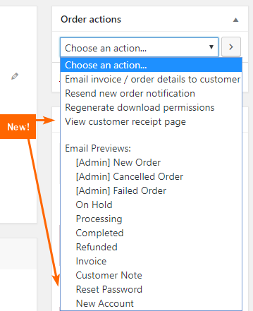
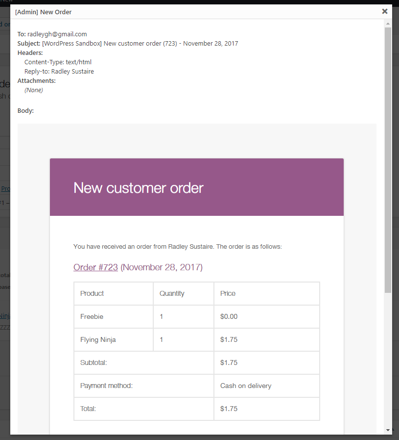

RS Preview WooCommerce Emails (WordPress Plugin)
==

_Adds the ability to preview all WooCommerce order emails in a popup without sending an email._

    Contributors: radgh
    Donate link: https://paypal.me/radgh
    Tags: woocommerce, emails, debugging
    Requires at least: 3.2
    Tested up to: 4.9.8
    Stable tag: 1.1.0
    License: GPLv3
    License URI: http://www.gnu.org/licenses/gpl-3.0.txt

## Description ##

This plugin adds the ability to preview all WooCommerce order emails in a popup without sending an email. Accessible through the "Order Actions" dropdown when editing an order.

A bonus option includes the link to view a customer's "Completed Order" page - the same they see after they complete a purchase.

## Installation ##

1. Upload the plugin files to `/wp-content/plugins/rs-preview-woocommerce-emails/`, or install the plugin through the WordPress plugins screen.
1. Activate the plugin through the 'Plugins' screen in WordPress
1. Edit a WooCommerce order and find the new options in the Order Actions dropdown.
1. Select an order action and click the arrow, or submit button, to view the email in a popup. No email will be sent.
1. Note that you will have to change the order action dropdown back to the default in order to save an order.

## Frequently Asked Questions ##

**Are these email previews identical to what you would receive in your inbox?**

They are very close, but not exact. There are a few small downsides:

1. Some styles applied to the admin will apply in the popup. Most importantly, the fonts in the email preview may inherit from the dashboard and would not show in an email.
1. Some fields like the password reset key, new password, and other generated content are filled with dummy text such as XXXXXX.
1. Plugins that modify emails may not work properly in the popup. Although the popup uses official WooCommerce methods to generate content, it does not run any of the email filters which other plugins might otherwise hook into.

## Screenshots ##

## Changelog ##

#### 1.0
* First release

## Upgrade Notice ##

None yet.